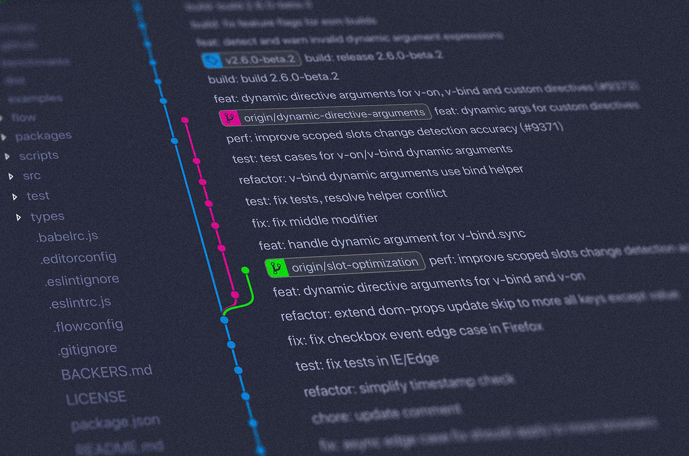

# Using Git for Version Control


## Week 4 (Afterword D)
Version control software allows you to take snapshots of a project whenever it’s in a working state. When you make changes to a project—for example, when you implement a new feature—you have the option of reverting back to a previous working state if the project’s current state isn’t functioning well. 
Using version control software gives you the freedom to work on improvements and make mistakes without worrying about ruining your project. This is especially critical in large projects, but can also be helpful in smaller projects, even when you’re working on programs contained in a single file.

The most popular source control tool is git nowadays. It is a distributed source control, which means multiple users/teams can work on the same repository (git’s term for folder/project) at the same time. It scales better than other tools.

**Agenda**
- [x] Introduction
- [x] Git
- [x] GitHub
- [x] git clone
- [x] git add
- [x] git commit
- [x] git status
- [x] git push
- [x] git pull
- [x] Merge Conflicts 
- [x] git log
- [x] Making Changes
- [ ] Branching


### Git: core commands
Adds files to a commit basket, in git it is called “staging”
    
    git add <file>

Commits staged changes
    
    git commit –m “message”

Pushes commits to the origin
    
    git push

### Git: first time in the project

We will start by preparing the project for git. First, we need to determine the root directory of the project. Then we will open terminal in that folder, and:
	
	git init
	
We just initialized the git for the project. It is called a git repository now. Next, we need to define which files will be stored in the repository:
	
	git add <file_path> (we do not need to manually add all the files in the directory, we can use . to add all of them (git add .), note the dot (.) after the git add command)
	
Now let’s make a first commit
	
	git commit –m “initial commit or some comment you prefer”
	
Yay, we have a commit! We can check the history:
	
	git log (you can quit git log by typing q)


### Git: remote server pushes

In the previous slide we created a git repository and we committed our first changes. To push them to a remote server, we need to connect our local repository to that remote server:
	
	git remote add origin https://our_preferred_server/repository.git
	
We can check if our remote is set:
	
	git remote –v
	
Now we can push our changes:
	
	git push

For more download the [git cheatsheet](https://github.github.com/training-kit/downloads/github-git-cheat-sheet.pdf).

Find [GitHub Desktop guide](https://help.github.com/en/desktop/getting-started-with-github-desktop/creating-your-first-repository-using-github-desktop) here.

##  Git Branch
Branching is a feature available in most modern version control systems. Git branches are effectively a pointer to a snapshot of your changes. When you want to add a new feature or fix a bug—no matter how big or how small—you spawn a new branch to encapsulate your changes. This makes it harder for unstable code to get merged into the main code base, and it gives you the chance to clean up your future's history before merging it into the main branch.


**How it works**

A branch represents an independent line of development. Branches serve as an abstraction for the edit/stage/commit process. You can think of them as a way to request a brand new working directory, staging area, and project history. New commits are recorded in the history for the current branch, which results in a fork in the history of the project.

The git branch command lets you create, list, rename, and delete branches. It doesn’t let you switch between branches or put a forked history back together again. For this reason, git branch is tightly integrated with the git checkout and git merge commands.

### Common Options

    git branch
List all of the branches in your repository. This is synonymous with git branch --list.

    git branch <branch>
Create a new branch called <branch>. This does not check out the new branch.

    git branch -d <branch>
Delete the specified branch. This is a “safe” operation in that Git prevents you from deleting the branch if it has unmerged changes.

    git branch -D <branch>
Force delete the specified branch, even if it has unmerged changes. This is the command to use if you want to permanently throw away all of the commits associated with a particular line of development.

    git branch -m <branch>
Rename the current branch to <branch>.

    git branch -a
List all remote branches. 

**Checking out branches**

The git checkout command lets you navigate between the branches created by git branch. Checking out a branch updates the files in the working directory to match the version stored in that branch, and it tells Git to record all new commits on that branch. Think of it as a way to select which line of development you’re working on.

Having a dedicated branch for each new feature is a dramatic shift from a traditional SVN workflow. It makes it ridiculously easy to try new experiments without the fear of destroying existing functionality, and it makes it possible to work on many unrelated features at the same time. In addition, branches also facilitate several collaborative workflows.

The git checkout command may occasionally be confused with git clone. The difference between the two commands is that clone works to fetch code from a remote repository, alternatively checkout works to switch between versions of code already on the local system.

    git checkout -b <new-branch>
The above example simultaneously creates and checks out <new-branch>. The -b option is a convenience flag that tells Git to run git branch <new-branch> before running git checkout <new-branch>

Switching branches is a straightforward operation. Executing the following will point HEAD to the tip of <branchname>.

    git checkout <branchname>

Assuming the repo you're working in contains pre-existing branches, you can switch between these branches using git checkout. To find out what branches are available and what the current branch name is, execute git branch.

    $> git branch
    master
    another_branch
    feature_inprogress_branch
    $> git checkout feature_inprogress_branch

## Steps to clone the project 
1. Copy the url of the repository ending with .git (https://github.com/2020spring/gitproject.git)

2. [optional] GitHub Desktop: 
    * Go to Current Repository
    * click on Add drop down
    * Clone Repository
    * click on URL tab
    * paste the copied URL (https://github.com/2020spring/gitproject.git)
    * choose the location from your local machine `C:\dev\` then click on Clone.

    Git Bash: navigate to the right directory `C:\dev\` and enter following:
      ```bash
      git clone https://github.com/2020spring/gitproject.git
      ```
3. [optional] Create your feature branch: 
      ```bash
      git checkout -b gitproject_john
      ```
4. Open the `C:\dev\gitproject` folder from your PyCharm and start modifying the code.

## How to set up git project in PyCharm

You can find the full instruction and video [here](https://www.jetbrains.com/help/pycharm/set-up-a-git-repository.html#add-remote)

## References

* [GitHub Guides](https://guides.github.com/activities/hello-world/)
* [CS50 - Git and GitHub (video)](https://youtu.be/eulnSXkhE7I)
* [git cheatsheet](https://github.github.com/training-kit/downloads/github-git-cheat-sheet.pdf)

changed 